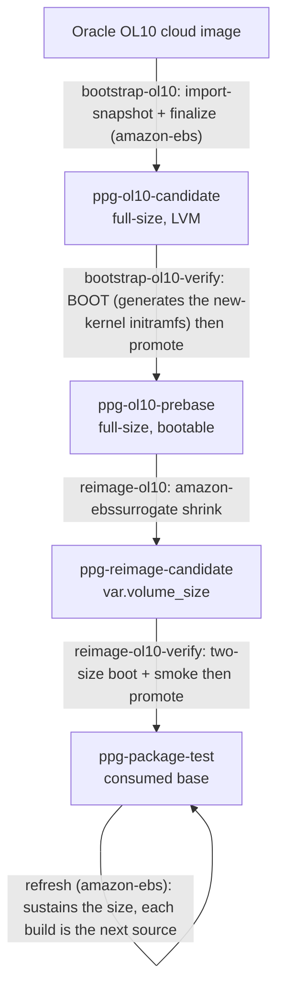
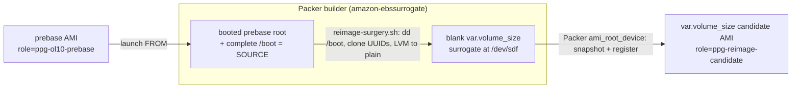

# OL10 re-image (one-time root shrink)

This page explains how the OL10 base root is shrunk to `var.volume_size`, and why
each non-obvious step works the way it does. The Packer template
(`reimage/reimage-ol10.pkr.hcl`) and its single provisioner
(`scripts/reimage-surgery.sh`) keep only short pointers back to this page, so the
full reasoning lives in one place.

## Why this exists

The OL10 lineage starts from Oracle's official cloud image, and that image ships a
root larger than the `var.volume_size` (20 GiB) that OL8 and OL9 use. The ordinary
[refresh](../README.md) path cannot shrink it on its own, because two limits get
in the way:

- EBS cannot restore a volume that is smaller than its source snapshot.
- XFS cannot shrink in place.

Reaching a smaller root therefore takes a one-time, file-level re-image: copy the
root contents onto a fresh, smaller volume, snapshot that volume, and register it
as a new base. OL8 and OL9 never need this step, because their bases already sit
at `var.volume_size`.

## Where it fits

Both BOOT steps in that flow are essential, not just sanity checks. The
`bootstrap-ol10-verify` boot of the full-size base is the moment the
freshly-installed kernel's initramfs is generated and `/boot` settles, so the
later shrink copies a `/boot` that is already complete and bootable.

The re-image is **one-time per arch**. Once it has run, the refresh path sustains
the smaller size on its own. You only need to run it again when one of these
happens:

- A fresh oversized source has been re-bootstrapped (a FORCE rebuild, or a new Oracle image).
- `var.volume_size` is lowered further. The refresh can grow or hold a root, but it can never shrink below the current snapshot.

## How it runs (amazon-ebssurrogate)

`reimage/reimage-ol10.pkr.hcl` is a Packer `amazon-ebssurrogate` build. It
launches a builder from the prebase (`source_ami_filter` with role
`ppg-ol10-prebase`), attaches a blank `var.volume_size` surrogate volume
(`launch_block_device_mappings`), and runs `scripts/reimage-surgery.sh` as a
provisioner. It then snapshots that surrogate and registers the candidate AMI
from it (`ami_root_device`). Packer owns the whole launch, attach, snapshot,
register, and cleanup lifecycle, so none of that orchestration is hand-rolled.

The single provisioner, `scripts/reimage-surgery.sh`, runs as root on that
builder. Because the builder boots from the already-booted prebase that is being
shrunk, the builder's live root and its complete `/boot` are themselves the
source. The script finds the blank `ROOT_GIB` surrogate by its size (Packer
attaches it, so there is no VolumeId to match against) and reproduces the root
onto it at the smaller size. No `dnf` or kernel work happens during the surgery,
so the prebase's already-generated initramfs is simply copied across. That is
exactly why the shrink runs after the prebase boot-verify, rather than being
folded into finalize.

## Surgery internals

### Partition layout

Root is always the last partition so that it can grow, since cloud-init's
`growpart` expands it on first boot. The offsets, in MiB, are:

| | arm64 (UEFI) | x86_64 (BIOS) |
|---|---|---|
| p1 | ESP 1-201 | bios_grub 1-3 |
| p2 | boot 201-1225 | boot 3-1027 |
| p3 | swap 1225-5321 | swap 1027-5123 |
| p4 | root 5321-100% | root 5123-100% |

`reimage-ol10-verify` derives its post-`growpart` floor from the non-root overhead
(the ESP or bios partition, plus boot, plus swap), so that check stays correct
even if this table changes.

### `/boot` is `dd`'d verbatim, not `mkfs` + copy

A fresh `mkfs.xfs` on EL10 produces an XFS on-disk format (`nrext64`) that GRUB
cannot read, which would leave the firmware unable to find `/boot`. Copying the
partition with `dd` preserves both the original format and its UUID. The kernel
itself can read any XFS, so only `/boot` (and the ESP) have to stay
GRUB-readable. The root filesystem can be a fresh `mkfs`.

### Cloned UUIDs

Every filesystem UUID is cloned onto the target (`mkfs.xfs -m uuid=...`,
`mkswap -U`, `mkfs.fat -i`), so `/etc/fstab` and the GRUB cmdline still resolve
without any change. The target is mounted with `-o nouuid` because the source
filesystem, which carries the same UUID, is still mounted on the builder.

### LVM source -> plain-partition root (x86_64)

The x86_64 base is LVM-rooted, and a second volume group of the same name cannot
coexist on the builder, so the root is converted to a plain partition. The surgery
rewrites the GRUB cmdline and the future-kernel seed `/etc/kernel/cmdline`,
turning `root=/dev/mapper/...` and `rd.lvm.lv=...` into `root=UUID=...`. The fstab
is already written by UUID. `os-prober` is disabled so that `grub2-mkconfig` does
not graft the builder's own root into the generated config.

### Device naming

The target is a Nitro device (`/dev/nvme*`), so its partitions take a `p` suffix,
as in `nvme1n1p2`. The script derives that suffix by appending `p` only when the
device name ends in a digit, so a non-NVMe name such as `/dev/sdf` (which gives
`sdf2`) would still work.

## Fail-closed gates

Each of these gates refuses to produce an image that might be unbootable or the
wrong size:

- **/boot size guard** (`surgery`): never `dd` a source `/boot` larger than the target partition (silent truncation -> unbootable).
- **fstab-root invariant** (`surgery`): the target `/etc/fstab` root must be `UUID=<cloned>` or absent (root via cmdline). A `/dev/mapper` or bare-device pin would not resolve on the plain-partition target.
- **surviving-LVM grep** (`surgery`, x86_64): abort if any `vg_main` / `rd.lvm.lv` / `root=/dev/(mapper|dm-)` reference survives in any cmdline source, including the future-kernel seeds `/etc/kernel/cmdline` and `grubenv` (a clean immediate boot can still regress on the next kernel install otherwise).
- **root=UUID positive gate** (`surgery`, x86_64): abort unless the effective cmdline pins root by the cloned filesystem UUID.
- **size gate** (`verify`): never promote a base whose root snapshot exceeds `var.volume_size`, or the refresh could not launch it.
- **cross-env gate** (`verify`): never promote a candidate whose `factory_env` tag does not match the requested env (a test candidate can never reach the prod role by an omitted or wrong arg).
- **two-size boot + smoke** (`verify`): boot at `var.volume_size` and 30 GiB, assert `growpart` grew root, then run a fresh-boot smoke install before promotion.

## Cleanup and recovery

Packer owns the lifecycle of the build's instance, surrogate volume, snapshot, and
AMI, including cleanup when a build fails. On top of that, `reimage-surgery.sh`
traps `EXIT` so it can thaw `/boot` if it is still frozen and unmount
`/mnt/target` from the deepest mount upward. That way, even a failure partway
through the surgery leaves the builder clean for Packer to detach.

If a `verify` fails and leaves an orphaned candidate behind (role
`ppg-reimage-candidate`, never consumed), `just prune-stale` reaps it.
