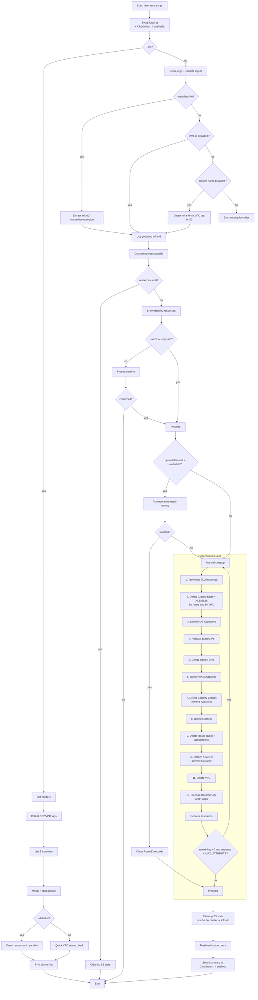

# Add comprehensive OpenShift cluster destroyer script

## Summary

This PR introduces a robust bash script for safely destroying OpenShift clusters on AWS. The script handles multiple cluster states including properly installed clusters, orphaned clusters without state files, and partially created clusters that failed during installation.

## Key Features

### Core Capabilities
- **Multi-method destruction**: Attempts openshift-install first, falls back to manual AWS cleanup
- **Comprehensive resource cleanup**: Handles EC2, VPC, ELB, Route53, S3, and all associated resources  
- **Auto-detection**: Automatically discovers infrastructure IDs from cluster names
- **Orphaned cluster support**: Can destroy clusters even without metadata/state files
- **Reconciliation loop**: Multiple attempts with intelligent retry logic for stubborn resources

### Safety Features
- **Dry-run mode**: Preview all resources before deletion with `--dry-run`
- **Confirmation prompts**: Requires explicit confirmation before destructive actions
- **Input validation**: Prevents injection attacks with strict input sanitization
- **Detailed logging**: Local file logging + optional CloudWatch integration
- **Resource verification**: Post-destruction verification to ensure complete cleanup

### Operational Features
- **List clusters**: Discover all OpenShift clusters in a region with `--list`
- **Flexible targeting**: Destroy by cluster name, infra-id, or metadata file
- **Parallel operations**: Optimized API calls for faster resource counting
- **Progress tracking**: Real-time status updates during destruction
- **S3 state management**: Automatic cleanup of cluster state files
- **Flexible logging**: Custom log paths with `--log-file`, disable with `--no-log`
- **Color control**: Disable colors with `--no-color` for CI/CD pipelines
- **No jq dependency**: Uses native Unix tools for JSON parsing

## Architecture Overview




## Usage Examples

### List all clusters in a region
```bash
./scripts/destroy-openshift-cluster.sh --list
./scripts/destroy-openshift-cluster.sh --list --detailed  # With resource counts
```

### Destroy a cluster
```bash
# By cluster name (auto-detects infra-id)
./scripts/destroy-openshift-cluster.sh --cluster-name my-cluster

# By infrastructure ID
./scripts/destroy-openshift-cluster.sh --infra-id my-cluster-abc12

# Using metadata file
./scripts/destroy-openshift-cluster.sh --metadata-file /path/to/metadata.json
```

### Preview destruction (dry-run)
```bash
./scripts/destroy-openshift-cluster.sh --cluster-name my-cluster --dry-run
```

### Force deletion without prompts
```bash
./scripts/destroy-openshift-cluster.sh --cluster-name my-cluster --force
```

### Customize reconciliation attempts
```bash
./scripts/destroy-openshift-cluster.sh --cluster-name stubborn-cluster --max-attempts 10
```

### Logging options
```bash
# Custom log file location
./scripts/destroy-openshift-cluster.sh --cluster-name my-cluster --log-file /var/log/destroy.log

# Disable file logging (console only)
./scripts/destroy-openshift-cluster.sh --cluster-name my-cluster --no-log

# Disable colored output for CI/CD
./scripts/destroy-openshift-cluster.sh --cluster-name my-cluster --no-color
```

## Resource Deletion Order

The script follows a carefully designed deletion order to handle AWS dependencies:

1. **EC2 Instances** - Terminate all instances first
2. **Load Balancers** - Delete ELBs/ALBs/NLBs (releases public IPs)
3. **NAT Gateways** - Remove NAT gateways
4. **Elastic IPs** - Release allocated IPs
5. **Network Interfaces** - Clean orphaned ENIs
6. **VPC Endpoints** - Remove endpoints
7. **Security Groups** - Delete after removing dependencies
8. **Subnets** - Delete VPC subnets
9. **Route Tables** - Remove custom route tables
10. **Internet Gateway** - Detach and delete IGW
11. **VPC** - Finally delete the VPC itself
12. **Route53** - Clean DNS records
13. **S3 State** - Remove cluster state files

## Error Handling

- **Timeout protection**: Commands timeout after 30 seconds to prevent hanging
- **Graceful degradation**: Falls back to manual cleanup if openshift-install fails
- **Reconciliation loop**: Automatically retries failed deletions
- **Dependency resolution**: Removes security group rules before deletion to break circular dependencies
- **State verification**: Post-destruction check ensures complete cleanup

## Requirements

- AWS CLI configured with appropriate credentials
- Standard Unix tools (grep, sed, awk - pre-installed on most systems)
- Optional: openshift-install binary for metadata-based destruction
- Optional: timeout command (coreutils) for operation timeouts

## Security Considerations

- Input validation prevents injection attacks
- Restricted file permissions on log files (600)
- No sensitive data logged to CloudWatch
- AWS profile validation before operations
- Confirmation prompts prevent accidental deletions

## Files Changed

- `scripts/destroy-openshift-cluster.sh` - New comprehensive destroyer script (2000+ lines)

## Testing Recommendations

1. Test with `--dry-run` first to verify resource detection
2. Test on a small test cluster before production use
3. Verify S3 state cleanup for your bucket naming convention
4. Test reconciliation with partially deleted clusters
5. Validate CloudWatch logging if using in CI/CD

## Related Documentation

- [OpenShift on AWS Documentation](https://docs.openshift.com/container-platform/latest/installing/installing_aws/installing-aws-default.html)
- [AWS Resource Tagging](https://docs.aws.amazon.com/general/latest/gr/aws_tagging.html)
- Script includes comprehensive inline documentation and help text
